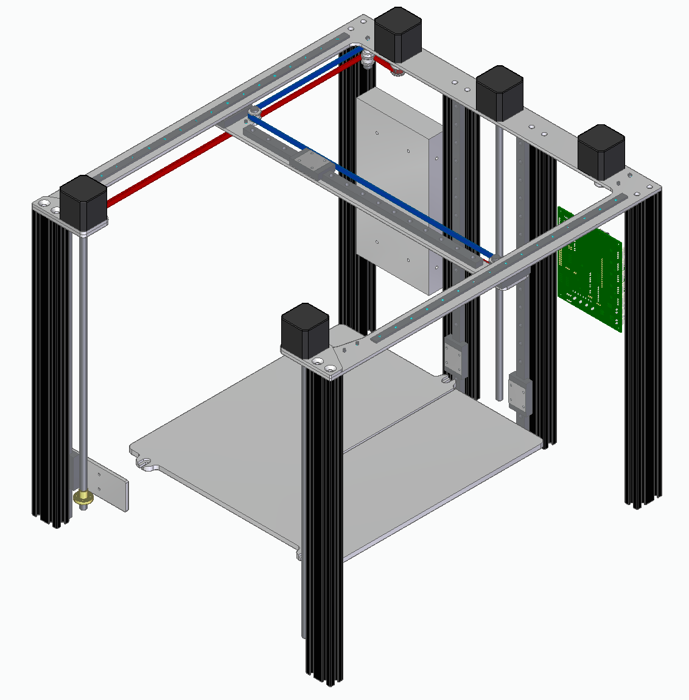
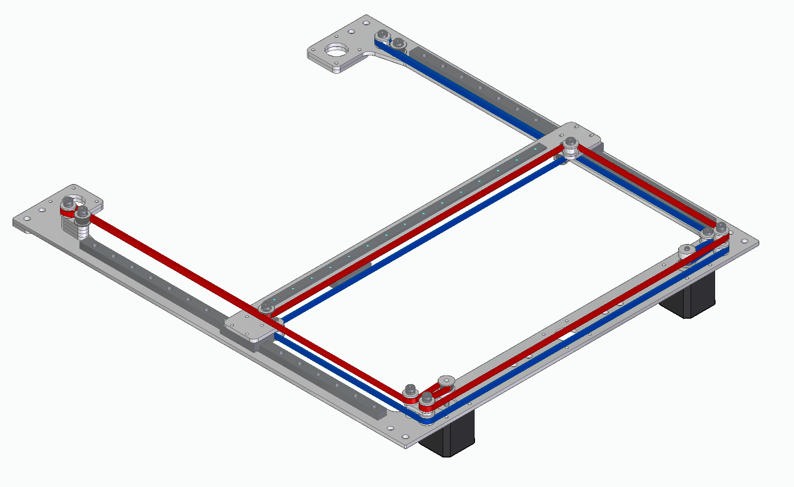

# iberus_printer
a 3D printer designed to avoid shortcomings I've observed on the most popular kit 3D printers

Very much a work in progress, everything will change as I improve the design and reach optimized implementations of all the ideas I wish to put in this machine.

General design intentions:
- XYZ gantry referenced to a single reference piece (laser-cut 4mm aluminum plate with stacked stiffeners where needed)
  - Similar to E3D's toolchanger motion system but the Z axis is also referenced to the same plane
  - The 4mm thickness is not a strict constraint, the design should accomodate different thicknesses to make it easy to source from local laser cutting services
- All the print bed should be entirely reachable by the nozzle easily
  - After configuring a Railcore II at work, I was very disappointed that the printhead would collide with the frame or the Z axis if we tried to use the full advertised 300x300mm print area.
- Reuse existing major components from other kit 3D printers when possible
  - Examples: Railcore bed, Voron LDO steppers, bed kinematic coupling
- Precision achieved by not being overconstrained
  - Examples: Y carriage fixed on left side but slotted on right side, bed kinematic coupling
- Electronics not mounted on the bottom of the printer
  - A heavy machine like a 3D printer should not need to flipped on its side to do maintenance
- Piezo ABL probe (using Pyr0ball PCB's sensor)
  - Not magnet dependant, wont be affected by strong buildplate magnets
  - No Z offset to change with every nozzle swap
  - Much faster than bltouch
  - Surface independant
- The main goal of the machine is not speed but reliability and ease of assembly and alignment to maximize precision
  - Some design decisions may lead to a machine that is quite fast, but that's mostly a coincidence

Future ideas once MVP is done:
- pegboard side panels, similar to bambu lab P1P accessories
- cover plates on top to hide cables and provide mounting points for top enclosure
- enclosure with insulated side panels
- active chamber heater (reserve some space at bottom of electronics enclosure)
- extended Y travel for toolchanger functionality (need to flip belt path on other side of X axis)
- berd air part cooling to reduce toolhead footprint
- watercooled hotend to reduce toolhead footprint
- adapters for using many different beds from other kits
- flattened cable chain to reduce vertical footprint
- all remote mechanisms for toolhead: berd air part cooling, watercooled hotend, zesty nimble extruder
- force analysis of X gantry for weight optimization

Note on the "iberus" name: it's a genus of land snails that have a flat shell. I thought it matched the overall design of having everything referenced to a flat top.
